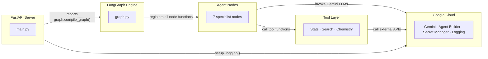
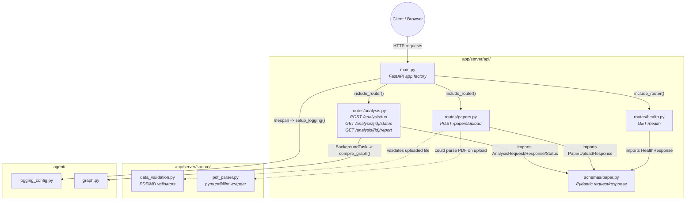
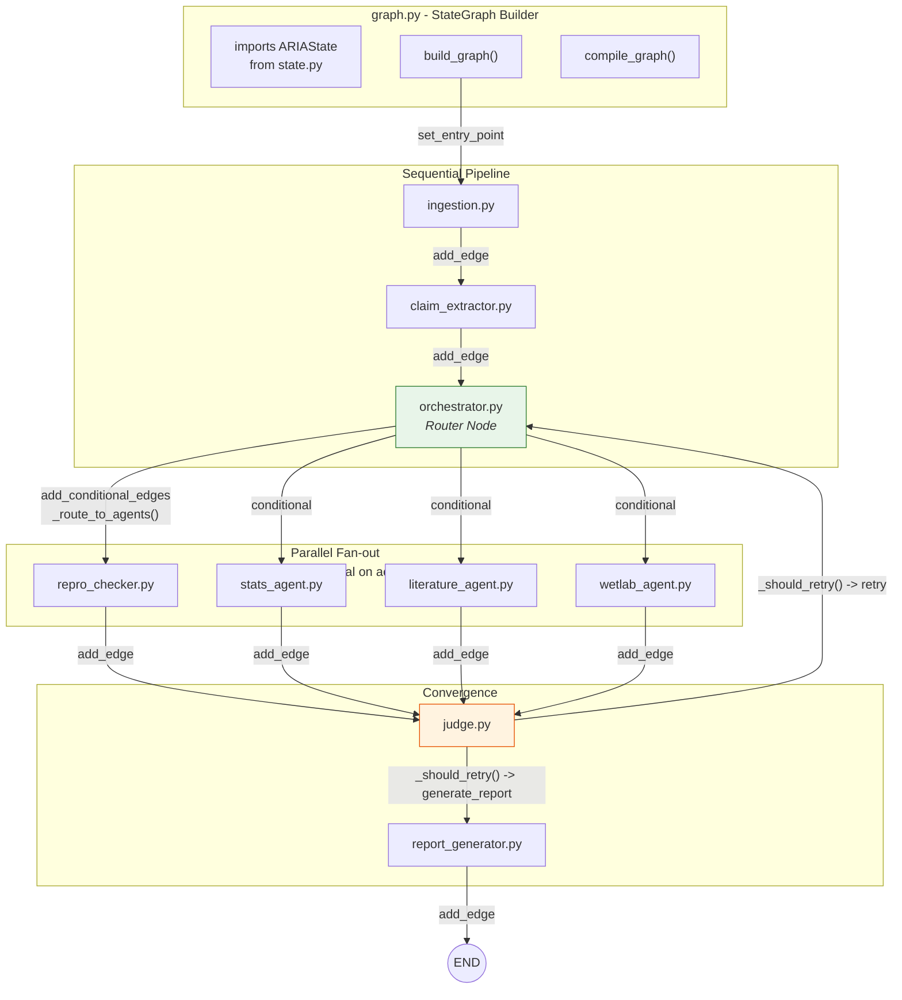
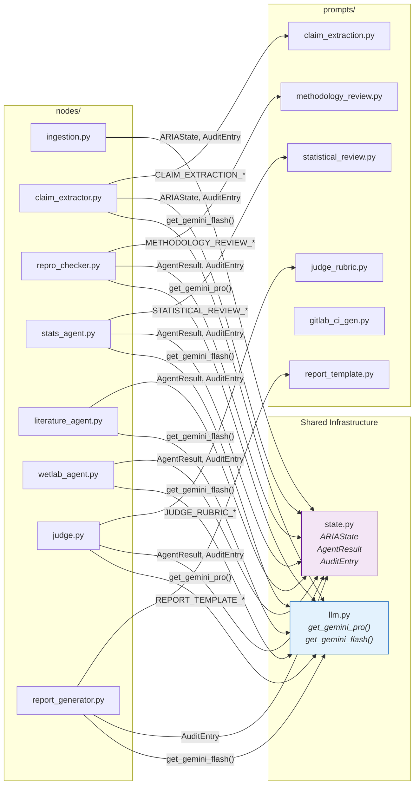
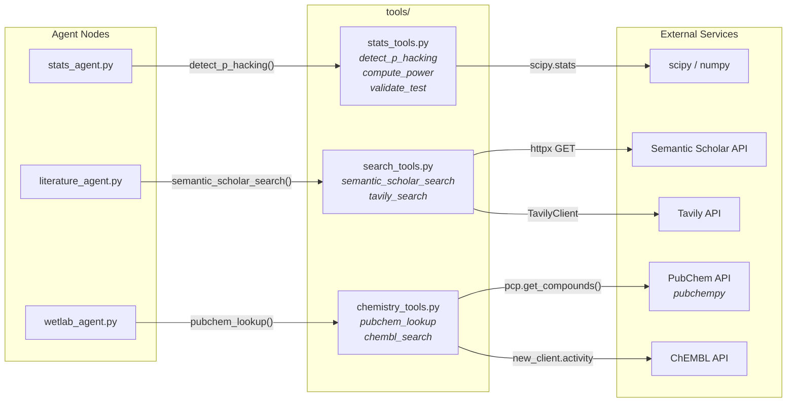
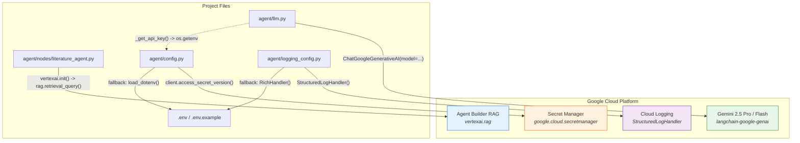
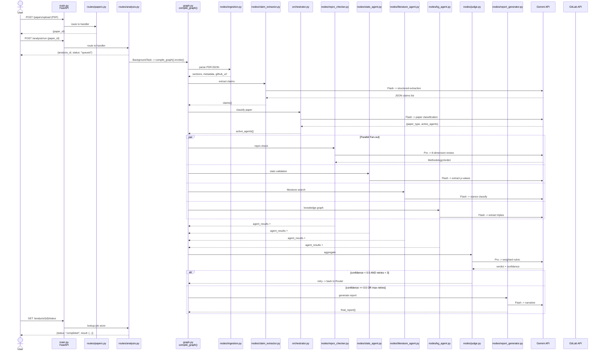

<div align="center">

# ARIA — Autonomous Research Integrity Agent

**An AI-powered multi-agent system that autonomously audits scientific research papers for reproducibility, statistical validity, and methodological rigor.**

[](https://python.org)
[](https://langchain-ai.github.io/langgraph/)
[](https://ai.google.dev/)
[](https://build.nvidia.com/)
[](https://fastapi.tiangolo.com/)
[](LICENSE)

---

*Over 70% of researchers have failed to reproduce another scientist's experiments, costing ~$28B annually in wasted preclinical research. ARIA automates the painstaking, expert-intensive process of auditing research integrity — turning days of manual review into minutes of autonomous AI analysis.*

</div>

---

## Table of Contents

- [The Problem](#the-problem)
- [What ARIA Does](#what-aria-does)
- [System Architecture](#system-architecture)
  - [Master Component Map](#1-master-component-map)
  - [FastAPI Server](#2-fastapi-server)
  - [LangGraph Orchestration](#3-langgraph-orchestration-core)
  - [Agent Nodes](#4-agent-node-dependencies)
  - [Tools Layer](#5-tool-layer)
  - [Google Cloud Integration](#6-google-cloud-integration)
  - [Shared State Bus](#7-shared-state-data-bus)
  - [Request Lifecycle](#8-full-request-lifecycle)
- [Tech Stack](#tech-stack)
- [Data Models](#data-models)
- [Project Structure](#project-structure)
- [Getting Started](#getting-started)

---

## The Problem

The **reproducibility crisis** is one of the most pressing issues in modern science. Manually auditing a paper for reproducibility — checking statistical validity, methodology rigor, reagent transparency, and literature consistency — is a **painstaking, expert-intensive process** that can take days per paper.

## What ARIA Does

Given a research paper (PDF or Markdown), ARIA autonomously:

1. **Ingests & parses** the paper into structured sections
2. **Extracts every testable scientific claim** using LLM-powered analysis
3. **Classifies the paper type** (experimental, computational, clinical, review, etc.)
4. **Dispatches specialist AI agents in parallel** — each auditing a different dimension
5. **Aggregates findings through a Judge agent** with a confidence-based retry loop
6. **Generates a structured reproducibility report** with per-claim verdicts and recommendations

> **Note:** ARIA is *not* a plagiarism checker. It is a **deep scientific audit system** that reasons about methodology, statistics, experimental design, and cross-references with existing literature.

---

## System Architecture

### 1. Master Component Map

Top-level dependency flow across the FastAPI server, LangGraph engine, agents, cloud services, and tools.



---

### 2. FastAPI Server

HTTP request flow through route handlers, schemas, validators, parsers, logging, and graph invocation.



| Endpoint | Method | Purpose |
|---|---|---|
| `/health` | `GET` | Health check |
| `/papers/upload` | `POST` | Upload PDF/Markdown research papers |
| `/analysis/run` | `POST` | Trigger analysis pipeline for a paper |
| `/analysis/{id}/status` | `GET` | Poll analysis job status |
| `/analysis/{id}/report` | `GET` | Retrieve the final reproducibility report |

---

### 3. LangGraph Orchestration Core

How `graph.py` wires the sequential path, conditional parallel fan-out, retry loop, and report generation.



**Key design**: The Orchestrator classifies papers into one of 7 types and conditionally activates only relevant agents:
`quantitative_experimental` · `omics` · `methodological` · `clinical_translational` · `computational_bioinformatics` · `review_meta_analysis` · `hybrid`

---

### 4. Agent Node Dependencies

The shared import pattern — every node uses model factories, state types, and prompt templates.



| Agent | LLM Used | Focus Area |
|---|---|---|
| **Claim Extractor** | Gemini Flash | Extracts every testable scientific claim with type, strength, QRP flags |
| **Reproducibility Evaluator** | Gemini Pro | 8-dimension methodology review (controls, blinding, sample size, etc.) |
| **Statistics Agent** | Gemini Flash + scipy | P-value extraction, p-hacking detection, power analysis |
| **Wet Lab Agent** | Gemini Flash | Reagent tracking, protocol completeness, experimental design |
| **Tool Calling Agent** | Gemini Flash | Intelligent middleware — dispatches computational verification tools |

---

### 5. Nodes And Tools

Runtime tool calls made by specialist agent nodes and the external services behind them.



The **Tool Calling Agent** uses a registry pattern — it receives upstream agent outputs, reasons about the data shape via LLM, and dispatches verification tasks:

| Tool Module | Functions | Dependency |
|---|---|---|
| `statistical_tools.py` | `detect_p_hacking()`, `compute_power()`, `validate_test()` | `scipy.stats`, `numpy` |
| `verification_tools.py` | Structural validation, cross-reference checks | Internal |
| `ingestion_tool.py` | Document parsing utilities | `pymupdf4llm` |
| `tool_registry.py` | Central registry: tool name → callable mapping | Internal dispatch |

---

### 6. Google Cloud Integration Points

Project files that call Gemini, Agent Builder RAG, Secret Manager, and Cloud Logging.



**Configuration cascading strategy:**
1. **Google Secret Manager** → checked first (production)
2. **Environment variables** → `os.getenv()` (CI/containers)
3. **`.env` file** → `python-dotenv` fallback (local development)

---

### 7. Shared State Data Bus

Fields in `ARIAState` that each graph node writes or reads during execution.

```mermaid
graph TD
    subgraph STATE["ARIAState (TypedDict in state.py)"]
        IN["Input Fields<br/><i>paper_id, raw_text,<br/>sections, metadata</i>"]
        EXT["Extraction Fields<br/><i>claims, github_url,<br/>active_agents, paper_type</i>"]
        RES["Agent Result Fields<br/><i>methodology_verdict<br/>stats_verdict<br/>literature_evidence<br/>wetlab_verdict<br/>agent_results +</i>"]
        AGG["Aggregation Fields<br/><i>retry_count<br/>confidence_score</i>"]
        OUT["Output Fields<br/><i>final_report<br/>audit_trail +</i>"]
    end

    ING["ingestion"] -->|"writes"| IN
    ING -->|"writes github_url"| EXT
    CLM["claim_extractor"] -->|"writes claims"| EXT
    ORC["orchestrator"] -->|"writes active_agents, paper_type"| EXT
    REPRO["repro_checker"] -->|"writes methodology_verdict"| RES
    STATS["stats_agent"] -->|"writes stats_verdict"| RES
    LITAG["literature_agent"] -->|"writes literature_evidence"| RES
    KGAG["kg_agent"] -->|"writes kg_contradictions"| RES
    GLAB["gitlab_sandbox"] -->|"writes code_verdict"| RES
    WLAB["wetlab_agent"] -->|"writes wetlab_verdict"| RES
    REPRO -->|"+ appends"| RES
    STATS -->|"+ appends"| RES
    LITAG -->|"+ appends"| RES
    KGAG -->|"+ appends"| RES
    GLAB -->|"+ appends"| RES
    WLAB -->|"+ appends"| RES
    JDG["judge"] -->|"reads agent_results<br/>writes confidence_score"| AGG
    RPT["report_generator"] -->|"reads everything<br/>writes final_report"| OUT

    style RES fill:#e8f5e9,stroke:#2e7d32
    style STATE fill:#fafafa,stroke:#333
```



**Key design — Fan-In Aggregation:**

```python
agent_results: Annotated[list, operator.add]   # parallel agents append safely
audit_trail:   Annotated[list, operator.add]    # every action is traced
```

LangGraph automatically merges lists from parallel branches when they converge at the Judge node.

---

### 8. Full Request Lifecycle

End-to-end sequence from upload through background graph execution and final report retrieval.



---

## Tech Stack

### AI Models

| Model | Provider | Temp | Role |
|---|---|---|---|
| **Gemini 2.5 Pro** | Google | 0.2 | Complex reasoning — Judge, Reproducibility Evaluator |
| **Gemini 2.5 Flash** | Google | 0.1 | High throughput — Claim extraction, stats, wet lab, reports |
| **Nemotron 3 Super 49B** | NVIDIA NIM | 0.6 | Advanced structured extraction for specialized tasks |

### Orchestration & AI

| Technology | Version | Purpose |
|---|---|---|
| LangGraph | ≥1.1.10 | Graph-based agent orchestration, parallel fan-out, conditional edges |
| LangChain | ≥1.2.17 | LLM abstraction, prompt templates, structured output |
| LangSmith | ≥0.8.1 | Observability — trace every LLM call, latency, debug |
| langchain-google-genai | ≥2.1.0 | Gemini model integration |
| langchain-nvidia-ai-endpoints | 1.4.1 | NVIDIA NIM Nemotron integration |

### API & Server

| Technology | Version | Purpose |
|---|---|---|
| FastAPI | ≥0.115.0 | Async REST API with OpenAPI docs |
| Uvicorn | ≥0.34.0 | ASGI server |
| Pydantic | ≥2.13.3 | Data validation — the type contract between all agents |
| SSE-Starlette | ≥2.2.0 | Server-Sent Events for real-time streaming |

### Cloud Services (GCP)

| Service | Purpose |
|---|---|
| Gemini API | LLM inference |
| Agent Builder RAG | Literature retrieval via `vertexai.rag` |
| Secret Manager | Secure API key storage |
| Cloud Logging | Structured log ingestion |

### Scientific & Research Tools

| Tool | Purpose |
|---|---|
| scipy / numpy | Statistical validation — p-hacking detection, power analysis |
| spaCy | NLP — entity extraction, sentence segmentation |
| PubChem (`pubchempy`) | Chemical compound verification |
| ChEMBL | Bioactivity database lookup |
| Semantic Scholar API | Academic paper search & citation analysis |
| Tavily API | Web search for supplementary evidence |

### Development

| Tool | Purpose |
|---|---|
| Python 3.11+ | Runtime |
| pytest | Test framework |
| Rich | Dev-mode pretty logging |
| GitPython | Repository analysis |
| python-dotenv | Local secret management |

---

## Data Models

ARIA uses **20+ Pydantic models** defined in `Agent/state.py` that form the typed contract between every agent.

### Core Models

| Model | Purpose | Key Fields |
|---|---|---|
| `Claim` | Testable scientific claim | `claim_text`, `claim_type`, `evidence_strength`, `qrp_flags` |
| `StatisticalClaim` | Extracted statistical finding | `test_type`, `p_value`, `effect_size`, `sample_size`, `descriptive_value` |
| `MethodologyVerdict` | 8-dimension methodology review | `dimension_scores[]`, `overall_score`, `missing_details` |
| `WetlabVerdict` | Wet lab reproducibility audit | `reagents[]`, `protocols[]`, `controls`, `data_transparency` |
| `WetlabExtractionResult` | Raw LLM extraction for wet lab | `classification`, `reagents`, `protocols`, `methodology_assessment` |
| `AgentResult` | Generic agent output wrapper | `agent_name`, `score`, `confidence`, `details`, `timestamp` |
| `ReproducibilityEvaluation` | Final reproducibility judgment | `verdict`, `confidence`, per-dimension narratives |
| `ReproducibilityReport` | **The final output** | All assessments + `claims[]`, `recommendations[]`, `audit_trail[]` |
| `AuditEntry` | Traceability log entry | `timestamp`, `agent`, `action`, `latency_ms` |

### Tool Calling Models

| Model | Purpose |
|---|---|
| `ToolCall` | Single planned tool invocation (name, args, reasoning) |
| `ToolCallResult` | Execution result (success, result, error, latency) |
| `ToolCallingPlan` | LLM's plan for which tools to call |
| `ToolAgentResponse` | Final response after tool execution with synthesis |

### Enums

| Enum | Values |
|---|---|
| `ClaimType` | `empirical`, `theoretical`, `experimental`, `computational`, `methodological` |
| `EvidenceStrength` | `direct`, `indirect`, `inferred` |
| `ReproVerdict` | `reproducible`, `partially_reproducible`, `not_reproducible`, `insufficient_information` |
| `PaperType` | `quantitative_experimental`, `omics`, `methodological`, `clinical_translational`, `computational_bioinformatics`, `review_meta_analysis`, `hybrid` |

---

## Project Structure

```
ARIA-Autonomous-Research-Integrity-Agent/
├── Agent/                              # Core agent package
│   ├── __init__.py
│   ├── model.py                        # LLM factory (Gemini Pro/Flash, Nemotron)
│   ├── state.py                        # 20+ Pydantic models + ReprCheckState
│   ├── graph.py                        # LangGraph StateGraph builder
│   ├── config.py                       # Secret Manager → env → .env cascade
│   ├── logging_config.py              # Cloud Logging / Rich handler setup
│   ├── orchestrator.py                # Paper type classifier & agent router
│   ├── nodes/                          # Agent node implementations
│   │   ├── ingestion.py               #   PDF/MD parser
│   │   ├── claim_extractor.py         #   Scientific claim extraction
│   │   ├── reproducibility_evaluator.py  #   Methodology review
│   │   ├── statistics_agent.py        #   Statistical validity checker
│   │   ├── wetlab_agent.py            #   Wet lab reproducibility
│   │   └── tool_calling_agent.py      #   Tool dispatch middleware
│   ├── prompts/                        # Engineered LLM prompts
│   │   ├── claim_extraction.py        #   Few-shot claim extraction
│   │   ├── statistics_prompt.py       #   Statistical review
│   │   ├── wet_lab_prompt.py          #   Wet lab analysis
│   │   ├── tool_calling_prompt.py     #   Tool selection reasoning
│   │   └── report_template.py         #   Final report narrative
│   └── Tools/                          # Computational tools
│       ├── tool_registry.py           #   Tool name → function mapping
│       ├── statistical_tools.py       #   scipy p-hacking, power analysis
│       ├── verification_tools.py      #   Structural validation
│       └── ingestion_tool.py          #   Document parsing helpers
├── test/                               # Test suite
├── test_data/                          # Sample research papers
├── system_architecture.html           # Interactive Mermaid architecture docs
├── requirements.txt                    # Python dependencies
├── .env                                # Local secrets (dev only)
└── CLAUDE.md                           # AI assistant context
```

---


<div align="center">

**Built with using LangGraph, Gemini, and NVIDIA Nemotron**

</div>
